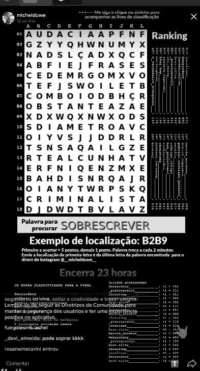

<br />
<p align="center">
  <h3 align="center">Word Finder Bot</h3>

  <p align="center">
    It's a bot written to find words in a TikTok word search game that happened for a while.
    It uses OpenCV and OCR to find the words. Unfortunately it's only works on Windows and it requires BlueStacks to open TikTok.
    <br />
	  <br />
    <a href="https://github.com/xandao6/word-finder-bot"><strong>Explore the docs »</strong></a>
    <br />
    <a href="https://github.com/xandao6/word-finder-bot/issue">Report Bug</a>
    ·
    <a href="https://github.com/xandao6/word-finder-bot/issues">Request Feature</a>
  </p>
</p>


<!-- TABLE OF CONTENTS -->
<details open="open">
  <summary>Table of Contents</summary>
  <ol>
    <li>
      <a href="#about-the-project">About The Project</a>
      <ul>
        <li><a href="#features">Features</a></li>
        <li><a href="#built-with">Built With</a></li>
      </ul>
    </li>
    <li>
      <a href="#getting-started">Getting Started</a>
      <ul>
        <li><a href="#installation">Installation</a></li>
      </ul>
    </li>
    <li><a href="#usage">Usage</a></li>
    <li><a href="#roadmap">Roadmap</a></li>
    <li><a href="#contributing">Contributing</a></li>
    <li><a href="#license">License</a></li>
    <li><a href="#contact">Contact</a></li>
  </ol>
</details>


<!-- ABOUT THE PROJECT -->
## About The Project

<div align="center">
  <a href="https://github.com/xandao6/word-finder-bot">
    
  </a>
</div>

### Features

* Read the target word from video using Tesseract OCR
* Read the matrix characters from video using OpenCV
* Reveal the position of the target word in the matrix

### Built With

* [python3](https://www.python.org/) - A high-level, general-purpose programming language
* [pynput](https://pypi.org/project/pynput/) - To read mouse and keyboard events
* [openCV](https://opencv.org/) - Computer vision library
* [pytesseract](https://pypi.org/project/pytesseract/) - Google's Tesseract OCR library
* [pywin32](https://github.com/mhammond/pywin32) - Windows API for python
* [fuzzywuzzy](https://github.com/seatgeek/thefuzz) - String matching using Levenshtein distance

<!-- GETTING STARTED -->
## Getting Started

To get a local copy up and running follow these simple steps.

### Installation

:warning: Windows only :warning:

1. Clone the repo
   ```sh
   git clone https://github.com/xandao6/word-finder-bot.git
   ```
2. Install dependencies
   ```sh
	cd word-finder-bot
	python3 -m pip install -r requirements.txt
	```

<!-- USAGE EXAMPLES -->
## Usage

1. Open TikTok on BlueStacks and find the word search game

2. Run the project

  ```sh
  python3 bot.py
  ```


<!-- ROADMAP -->
## Roadmap

See the [open issues](https://github.com/xandao6/word-finder-bot/issues) for a list of proposed features (and known issues).


<!-- CONTRIBUTING -->
## Contributing

Contributions are what make the open source community such an amazing place to be learn, inspire, and create. Any contributions you make are **greatly appreciated**.

1. Fork the Project
2. Create your Feature Branch (`git checkout -b feature/AmazingFeature`)
3. Commit your Changes (`git commit -m 'Add some AmazingFeature'`)
4. Push to the Branch (`git push origin feature/AmazingFeature`)
5. Open a Pull Request

<!-- LICENSE -->
## License

Distributed under the MIT License. See [LICENSE](./LICENSE.md) for more information.

Free software =)


<!-- CONTACT -->
## Contact

Alexandre Calil - [@xandao6](https://www.linkedin.com/in/xandao6/) - alexandrecalilmf@gmail.com

Project Link: [https://github.com/xandao6/word-finder-bot](https://github.com/xandao6/word-finder-bot)


<!-- LINKS & IMAGES Variables-->
<!-- https://www.markdownguide.org/basic-syntax/#reference-style-links -->
[contributors-shield]: https://img.shields.io/github/contributors/xandao6/repo.svg?style=for-the-badge
[contributors-url]: https://github.com/xandao6/repo/graphs/contributors
[forks-shield]: https://img.shields.io/github/forks/xandao6/repo.svg?style=for-the-badge
[forks-url]: https://github.com/xandao6/repo/network/members
[stars-shield]: https://img.shields.io/github/stars/xandao6/repo.svg?style=for-the-badge
[stars-url]: https://github.com/xandao6/repo/stargazers
[issues-shield]: https://img.shields.io/github/issues/xandao6/repo.svg?style=for-the-badge
[issues-url]: https://github.com/xandao6/repo/issues
[license-shield]: https://img.shields.io/github/license/xandao6/repo.svg?style=for-the-badge
[license-url]: https://github.com/xandao6/repo/blob/master/LICENSE.txt
[linkedin-shield]: https://img.shields.io/badge/-LinkedIn-black.svg?style=for-the-badge&logo=linkedin&colorB=555
[linkedin-url]: https://linkedin.com/in/xandao6
